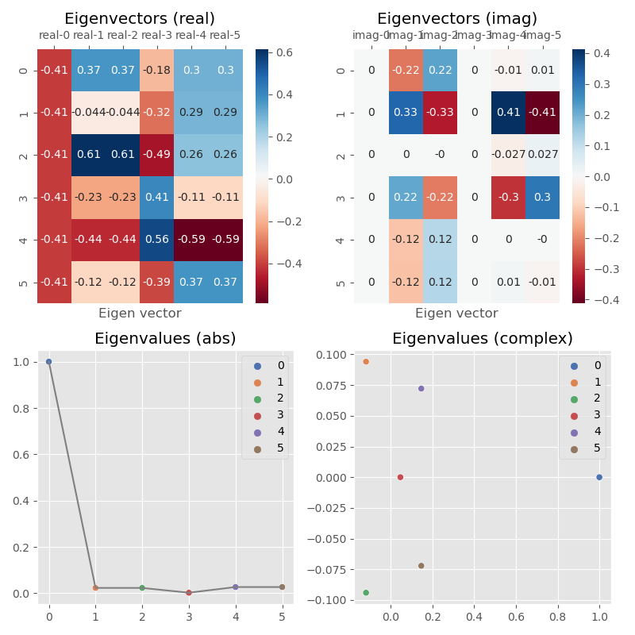

# Stochastic matrix explaining

---

## Math
The stochastic matrix is $A \in R^{n \times n}$

$$\begin{cases} \sum_{j=1}^{n} A_{ij} &= 1\\ A_{ij} &> 0 \end{cases}$$


The definition of the stochastic matrix and its properties reads in

[Stochastic matrix](https://en.wikipedia.org/wiki/Stochastic_matrix "Stochastic matrix")

The stochastic matrix in the code is the the right version, since

> A right stochastic matrix is a real square matrix, with each row summing to 1.

Define the all ones vector as following

$$E^{n \times 1} = [\underbrace{1, 1, \dots, 1}_n]^T$$

In the very long run, it follows

$$E = A \cdot E = A^N \cdot E = \lim_{N \rightarrow \infty} A^N \cdot E$$

As a result, the stochastic matrix has eigenvalues

$$\lVert \lambda_i \lVert \le 1$$

and the largest eigenvalue equals to $1$, and the eigenvector of the eigenvalue is $E$.
The other eigenvalues and eigenvectors follow the pattens as below



## Code description

- rnd_stochastic_matrix(rows: int = 6, cols: int = 6) -> np.array:
Generates a random stochastic matrix with the given number of rows and columns.
A stochastic matrix is a square matrix with nonnegative real entries where each row sums to 1.
This function generates a random matrix and normalizes it to be stochastic.

- compute_eig(mat: np.array):
Computes the eigenvalues and eigenvectors of a matrix.
This function calculates and returns the eigenvalues and eigenvectors 
of the input matrix using numpy's linalg.eig function.

- The [test.py](./test.py "test.py") script is the test instances for the functions.

```powershell
pytest test.py

# ==== test session starts ==================================
# platform win32 -- Python 3.11.4, pytest-7.4.2, pluggy-1.3.0
# rootdir: C:\Users\zcc\Desktop\eigen
# plugins: anyio-3.5.0
# collected 14 items
#
# test.py ..............
# ==== 14 passed, xx warnings in 1.48s ======================
```

## Code explanation (Auto generated by sourcery)

What?
This Python code generates a random stochastic matrix, computes its eigenvalues and eigenvectors, and visualizes the results.

How?
rnd_stochastic_matrix generates a random matrix and normalizes it. compute_eig calculates the eigendecomposition using NumPy.

The __main__ section provides a demo - generating a matrix, computing eigenvectors/values, and visualizing them with Pandas/Seaborn.

Coupling and Cohesion
The two functions are loosely coupled. The overall module has high cohesion related to stochastic matrices.

Single Responsibility Principle
Both functions follow SRP. rnd_stochastic_matrix handles generation, compute_eig handles decomposition. No extraction needed.

Unusual Things
None

Highly Suspicious
No input validation in compute_eig could lead to errors.
